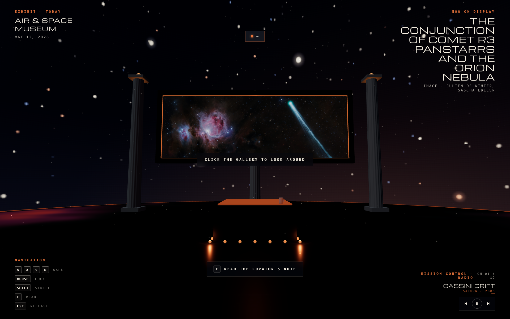
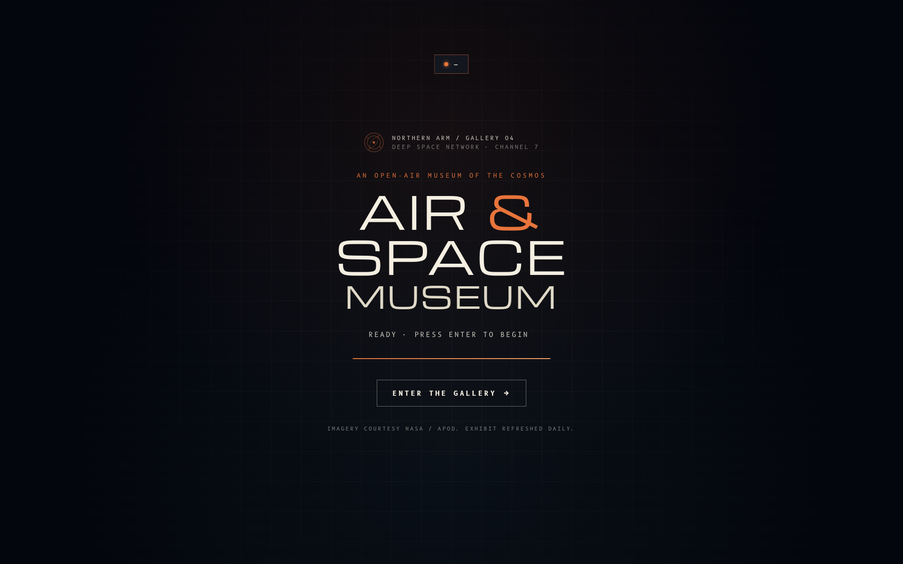
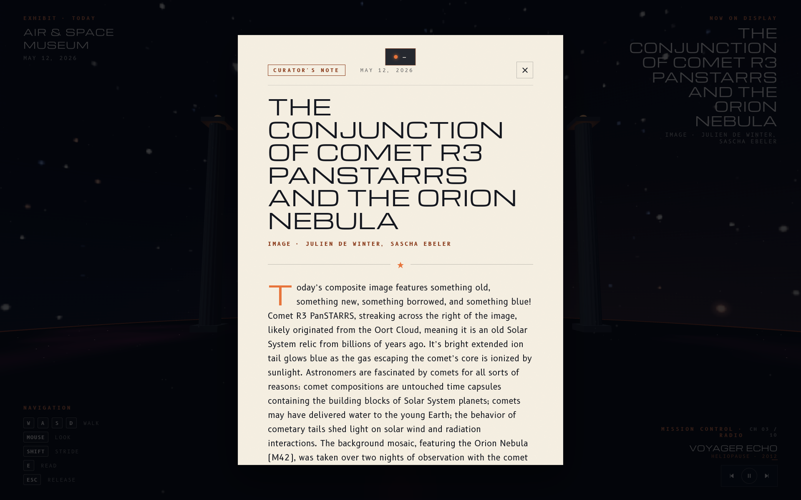
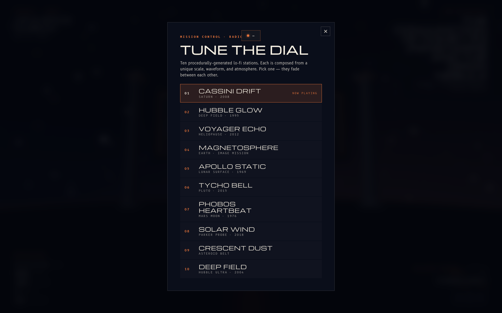
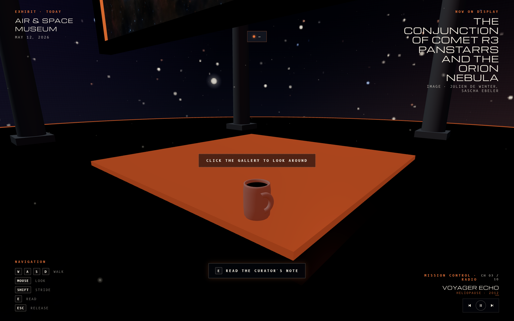

# Air & Space Museum · A NASA APOD Showcase

[](https://x.com/cypher_poet) [](https://www.paypal.com/ncp/payment/L6M553P28YPDY) [](https://cash.app/$CypherPoet) [](https://buymeacoffee.com/cypherpoet) [](https://linktr.ee/CypherPoet) [](https://github.com/CypherPoet/THREE-JS-APOD-Air-and-Space-Museum/blob/main/LICENSE)

[](https://cypherpoet.github.io/THREE-JS-APOD-Air-and-Space-Museum/) [](https://threejs.org/) [](https://apod.nasa.gov/apod/astropix.html)



An interactive, walk-through Three.js gallery whose centrepiece is NASA's **Astronomy Picture of the Day** — refreshed automatically every morning. Designed to feel like a small open-air museum drifting in deep space, with first-person controls, a procedural lo-fi radio, and a discoverable easter egg.

→ **Visit the live exhibit · [cypherpoet.github.io/THREE-JS-APOD-Air-and-Space-Museum](https://cypherpoet.github.io/THREE-JS-APOD-Air-and-Space-Museum/)**

---

## What's inside

- **Today's APOD as the centrepiece.** The day's image hangs in a hovering frame above a polished plinth. The frame auto-fits the image's aspect ratio.
- **No NASA API key required.** A nightly GitHub Action scrapes `apod.nasa.gov/astropix.html`, compresses the image with ImageMagick, and commits the metadata + image straight into the repo. The site fetches a local JSON file — same-origin, no proxy.
- **First-person navigation.** Pointer-lock + WASD + mouse-look on desktop; drag-to-look + tap-to-walk on mobile.
- **A ten-station procedural lo-fi radio.** Pure WebAudio — no audio files. Each station has its own scale, waveform, filter, and atmosphere (Cassini Drift, Hubble Glow, Voyager Echo, Magnetosphere, Apollo Static, Tycho Bell, Phobos Heartbeat, Solar Wind, Crescent Dust, Deep Field). Switching stations cross-fades.
- **An editorial reader.** Press <kbd>E</kbd> near the plinth (or click the on-screen prompt) for the curator's note — the full APOD explanation in a magazine-style overlay.
- **A hidden mug.** Somewhere on the plinth there's a small ceramic coffee mug. Find it, point at it, click it.

## A look around

| | |
|---|---|
|  |  |
| Boot sequence — telemetry handshake, Michroma display type | Curator's note — full APOD explanation, B612 body |
|  |  |
| The radio dial — all ten lo-fi stations | The hidden mug, glowing on the plinth |

There's also a recorded walkthrough at [`media/walkthrough.webm`](media/walkthrough.webm).

## How it works

```
┌──────────────────────────────────────────────────────────────┐
│  GitHub Action (cron: 06:30 UTC)                             │
│      └── node scripts/fetch-apod.mjs                         │
│              ├── fetch apod.nasa.gov/astropix.html           │
│              ├── parse title / date / credit / explanation   │
│              ├── download HD image, magick → ~250 KB JPEG    │
│              ├── append data/archive/<date>.{json,jpg}       │
│              └── update data/manifest.json (latest, entries) │
│                        ↓ git commit + push                   │
│  GitHub Pages auto-deploys                                   │
└──────────────────────────────────────────────────────────────┘
                                ↓
┌──────────────────────────────────────────────────────────────┐
│  Browser (index.html — no build step, no bundler)            │
│      ├── importmap → Three.js r169 from unpkg                │
│      ├── src/apod.js     manifest.latest → archive/<date>    │
│      ├── src/scene.js    starfield + pillars + plinth + mug  │
│      ├── src/controls.js PointerLockControls + WASD          │
│      ├── src/audio.js    WebAudio ten-station radio          │
│      └── src/main.js     raycaster picks the mug             │
└──────────────────────────────────────────────────────────────┘
```

### Design system

| Role | Family | Why |
|------|--------|-----|
| Display | [Michroma](https://fonts.google.com/specimen/Michroma) | Wide-spaced sci-fi console heritage |
| Body | [B612](https://fonts.google.com/specimen/B612) | Designed by Airbus for cockpit displays |
| Mono | [B612 Mono](https://fonts.google.com/specimen/B612+Mono) | Matching family for technical readouts |

Palette: cosmic navy `#04060d`, vellum `#f5efe2`, Voyager amber `#e8743b`, planetarium cyan `#5fb3c1`.

### Coffee mug, technically

A `LatheGeometry` revolves a 14-vertex profile to form the hollow ceramic body. A partial `TorusGeometry` arc makes the handle. A `CircleGeometry` disc inside is the dark coffee surface. Each frame, a `THREE.Raycaster` casts from the camera centre against an invisible hit cylinder slightly inflated around the mug — when it hits within ~3.5 metres, the emissive intensity ramps up, an idle bob plays, and the world-hint fades in. Click while pointer-locked → `window.open(BMC_URL)`.

## Run it locally

No npm install, no build. Just serve the directory:

```bash
git clone git@github.com:CypherPoet/THREE-JS-APOD-Air-and-Space-Museum.git
cd THREE-JS-APOD-Air-and-Space-Museum
python3 -m http.server 8767
open http://localhost:8767/
```

To refresh today's exhibit while developing:

```bash
node scripts/fetch-apod.mjs
```

## Project layout

```
.
├── index.html                       — shell with importmap + HUD markup
├── styles.css                       — typography, HUD, dial, reader, world-hint
├── src/
│   ├── main.js                      — wires everything, runs the raycaster
│   ├── scene.js                     — Three.js scene + the coffee mug
│   ├── controls.js                  — PointerLockControls + collisions
│   ├── audio.js                     — procedural ten-station radio
│   ├── apod.js                      — manifest.json → latest archive entry
│   └── ui.js                        — boot, HUD, reader, dial, toast
├── scripts/
│   └── fetch-apod.mjs               — APOD scraper (Node, no deps)
├── data/
│   ├── manifest.json                — { latest, entries: […] }
│   └── archive/
│       ├── YYYY-MM-DD.json          — one parsed entry per day
│       └── YYYY-MM-DD.jpg           — matching compressed image
├── media/                           — screenshots + walkthrough
├── .claude/
│   └── skills/
│       └── capture-museum-media/    — regenerates media/ via playwright-cli
├── .github/
│   └── workflows/
│       └── refresh-apod.yml         — daily cron at 06:30 UTC
├── .nojekyll                        — disables Jekyll on GitHub Pages
└── README.md
```

## Acknowledgements

- **Imagery + writing**: [NASA Astronomy Picture of the Day](https://apod.nasa.gov/), curated daily by Robert Nemiroff (MTU) & Jerry Bonnell (UMCP). Specific image and text credits appear in the in-museum HUD and reader overlay.
- **Three.js** (Ricardo Cabello & contributors)
- **Typefaces** by Vernon Adams (Michroma) and Airbus Group / Polytype (B612 / B612 Mono)

## License

Source code in this repo is MIT-licensed for personal/educational use. Imagery and explanatory text fetched from APOD are owned by their respective credited authors — see each day's `data/archive/<YYYY-MM-DD>.json` for attribution; visit `original_url` for the canonical source.

---

If this brought you joy, find the mug. ☕
